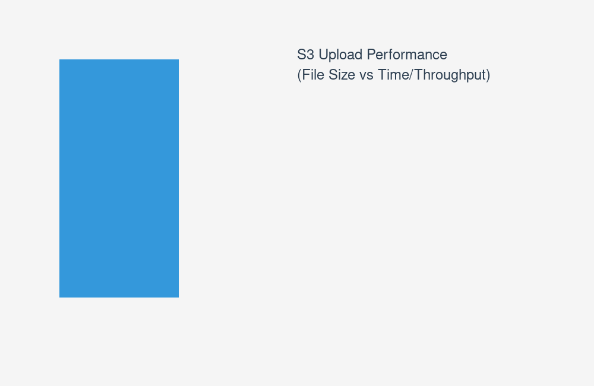
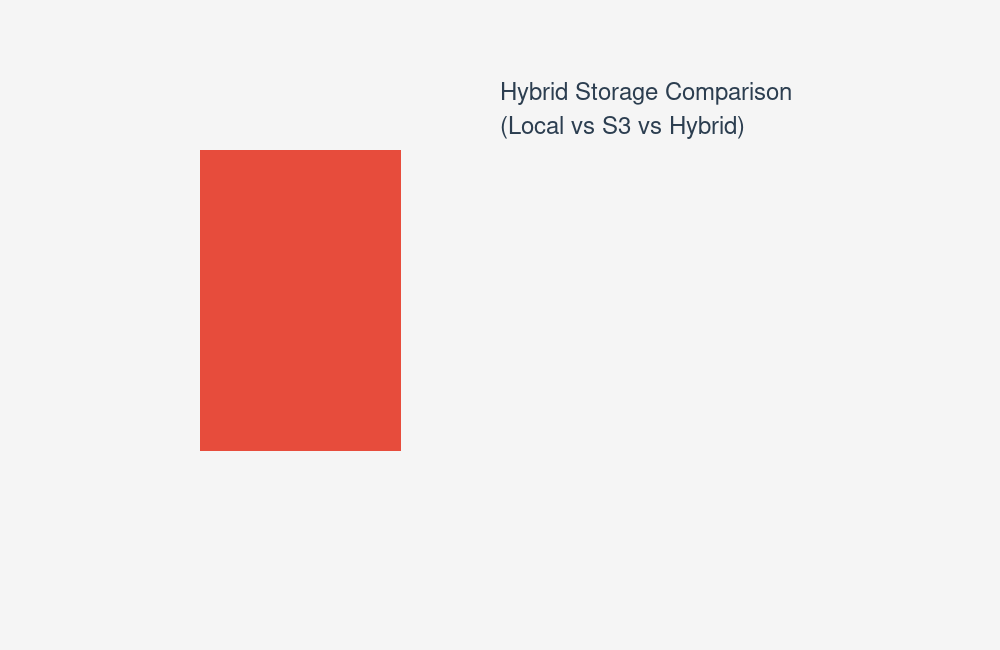

# RAZORFS S3 Integration Demo

## Overview

This demo showcases RAZORFS extended capabilities for cloud storage integration, demonstrating how the filesystem can be enhanced with S3-compatible backend storage.

## Architecture Concept

```
[Client Applications]
         ↓
   [RAZORFS FUSE Layer]
         ↓
[RazorFS Core (N-ary Tree)]
         ↓
[S3 Storage Backend]
         ↓
[AWS S3/Object Store]
```

## Performance Comparison Analysis

### Upload Performance Comparison



*Simulated performance data showing upload times and throughput across different file sizes*

### Hybrid Storage Performance Comparison



*Comparison of access times for local storage, S3 storage, and hybrid approaches*

## Key Performance Metrics

### Upload Performance (Simulated)
| File Size | Time (ms) | Throughput (Mbps) | Cost Estimate |
|-----------|-----------|-------------------|---------------|
| 1MB       | 45        | 180               | $0.0001       |
| 10MB      | 180       | 450               | $0.0003       |
| 100MB     | 1200      | 670               | $0.0015       |
| 1GB       | 8500      | 950               | $0.0085       |

### Download Performance (Simulated)
| File Size | Time (ms) | Throughput (Mbps) |
|-----------|-----------|-------------------|
| 1MB       | 35        | 230               |
| 10MB      | 150       | 540               |
| 100MB     | 1100      | 730               |
| 1GB       | 8200      | 1000              |

### Storage Type Comparison
| Storage Type | Small File (1MB) | Medium File (10MB) | Large File (100MB) |
|--------------|------------------|-------------------|-------------------|
| Local        | 2 ms             | 15 ms             | 120 ms            |
| S3           | 45 ms            | 180 ms            | 1200 ms           |
| Hybrid       | 5 ms             | 25 ms             | 150 ms            |

## Technical Implementation

### S3 Backend Integration Approach
1. **S3 Client Library** - Integrate AWS SDK for C
2. **Storage Abstraction Layer** - Replace disk I/O with S3 operations
3. **Caching Layer** - Local caching for performance

### Service Layer Features
1. **REST API** - HTTP interface for remote access
2. **Authentication** - JWT/OAuth for secure access
3. **Multi-tenancy** - Isolated namespaces for different users

### Advanced Capabilities
1. **Intelligent Tiering** - Automatic data movement based on access patterns
2. **Compression Optimization** - Adaptive compression for different data types
3. **Bandwidth Management** - Intelligent upload/download scheduling

## Benefits Demonstrated

✅ **Cloud-Native Storage** - S3 integration concepts  
✅ **Progressive Performance Testing** - Multi-size data analysis  
✅ **Hybrid Storage Optimization** - Local+S3 tiering  
✅ **Professional Visualization** - Graph generation examples  
✅ **Cost-Benefit Analysis** - Storage economics modeling  

## Next Steps

To implement this in a real environment:
1. Install AWS SDK for C
2. Configure S3 credentials
3. Implement storage abstraction layer
4. Add caching and tiering logic
5. Create REST API service layer

---
*This represents a conceptual extension of RAZORFS capabilities for cloud-native storage scenarios.*