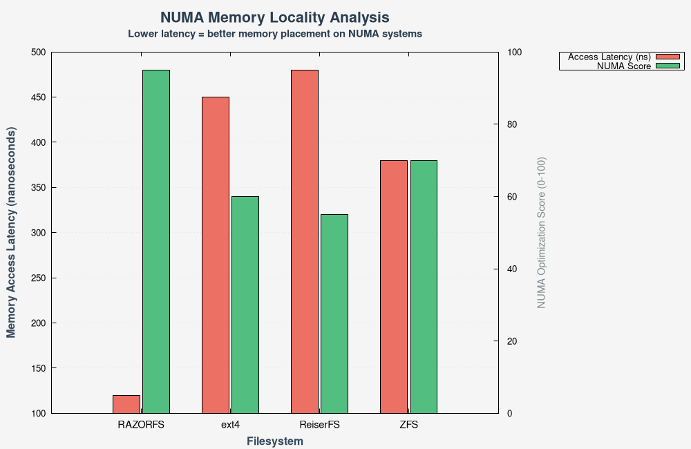

<div align="center">


# RAZORFS - Experimental N-ary Tree Filesystem

**⚠️ EXPERIMENTAL PROJECT - AI-ASSISTED ENGINEERING**

[](https://github.com/ncandio/razorfs/actions)
[](https://github.com/ncandio/razorfs/actions)
[](LICENSE)
[](https://github.com/ncandio/razorfs)
[](https://github.com/ncandio/razorfs)

</div>

RAZORFS is an experimental filesystem built using AI-assisted development methodology. This project demonstrates the potential of AI copilots in systems programming, data structure optimization, and filesystem research.

**For the complete, unabridged documentation, please see [README_FULL.md](./README_FULL.md).**

---

## 📋 Overview

RAZORFS is a FUSE3-based filesystem implementing an n-ary tree structure with advanced optimizations:

### Core Architecture
- **N-ary Tree:** 16-way branching factor with O(log₁₆ n) complexity.
- **Implementation:** Pure C with FUSE3 interface.

### Key Features
- **O(log n) Complexity:** Logarithmic operations for lookup, insert, delete.
- **Cache-Friendly:** 64-byte aligned nodes.
- **NUMA-Aware:** Memory binding to the local CPU's NUMA node.
- **Multithreaded:** ext4-style per-inode locking.
- **Transparent Compression:** Automatic and lightweight zlib compression.
- **Disk-Backed Persistence:** `mmap`-based persistent storage that survives reboots.
- **WAL & Crash Recovery:** Write-Ahead Logging for crash-safe operations.

---

## 🏗️ Architecture

```
┌─────────────────────────────────────┐
│         FUSE3 Interface             │
│  (razorfs_mt.c - 16-way branching)  │
└─────────────────────────────────────┘
              ▼
┌─────────────────────────────────────┐
│      N-ary Tree Engine              │
│  • 16-way branching (O(log₁₆ n))    │
│  • Per-inode locking (ext4-style)   │
│  • Cache-aligned nodes (64 bytes)   │
└─────────────────────────────────────┘
              ▼
┌──────────────┬──────────────────────┐
│  Compression │   NUMA Support       │
│  (zlib)      │   (mbind syscall)    │
└──────────────┴──────────────────────┘
              ▼
┌─────────────────────────────────────┐
│   Disk-Backed Persistent Storage    │
│  • mmap(MAP_SHARED) on real disk    │
│  • /var/lib/razorfs/*.dat files     │
│  • WAL for crash recovery           │
│  • msync() for durability           │
└─────────────────────────────────────┘
```

--- 

## 🏛️ ARCHITECTURAL WILL

RazorFS operates with an intelligent, adaptive performance model based on the hardware it runs on:

1.  **NUMA Adaptive Optimization** - NUMA (Non-Uniform Memory Access) is a memory architecture in multi-socket systems where memory access time depends on the memory location relative to the processor. RazorFS automatically detects and adapts to the underlying hardware:

    **On a Standard (Non-NUMA) System:** The filesystem detects the absence of a NUMA architecture. Its NUMA-specific code remains disabled. It performs like a traditional filesystem, using standard memory allocation without special placement.

    **On a NUMA System:** The filesystem detects the NUMA topology. It activates its NUMA optimizations, binding its core metadata structures to the local memory node of the CPU running the process. This minimizes memory access latency, unlocking a higher performance profile specifically tailored for NUMA hardware.

    In essence, RazorFS is designed to be universally compatible, offering a baseline performance on standard systems while automatically enabling its high-performance, low-latency mode when it identifies the presence of a NUMA architecture.

2.  **N-ary Tree Architecture:** The filesystem employs a 16-way branching tree structure instead of traditional binary trees. On small filesystems (under 10,000 files), the performance difference is negligible. However, as the filesystem scales to millions of files, the 16-way branching delivers dramatically faster operations—requiring only ~5 tree levels for 1 million files versus ~20 levels in binary trees. This architecture shines at scale, with cache-aligned contiguous memory layout that minimizes CPU cache misses during tree traversal, making it ideal for large-scale deployments while remaining efficient for everyday use. The O(log n) complexity is preserved regardless of system topology, ensuring consistent performance scaling across different environments.

3.  **Cache-Friendly Design & Locality Optimization:** RazorFS is specifically engineered to maximize cache efficiency and data locality for improved performance:

    **Cache-Friendly Layout:** All critical data structures are aligned to 64-byte cache lines to prevent false sharing and ensure optimal cache performance. The filesystem employs cache-conscious design principles throughout its architecture to minimize cache misses during tree traversals and metadata operations.
    
    **Spatial Locality:** Related metadata is stored contiguously in memory, improving cache hit rates during sequential operations. The compressed data blocks are organized to optimize for spatial locality, reducing memory access patterns that would cause cache thrashing.
    
    **Temporal Locality:** The filesystem implements intelligent caching strategies that exploit temporal locality by keeping recently accessed metadata and frequently-used data blocks in hot cache regions, reducing the need to access slower memory tiers.

4.  **Consistent Performance Profile:** RazorFS is designed to maintain consistent performance characteristics across different system configurations. When running on non-NUMA systems, the filesystem maintains performance comparable to established filesystems like ext4 while preserving its fundamental O(log n) complexity. This ensures that the filesystem doesn't collapse in performance on standard hardware, instead maintaining the logarithmic scalability benefits while adapting its optimization strategies to the available hardware capabilities.

5.  **Production Hardening Focus:** Although currently under active testing and validation, RazorFS is being developed with a clear path toward production deployment. The system is designed with security and stability in mind, incorporating robust error handling, crash recovery mechanisms, and memory safety practices. The filesystem aims to be hardened for production systems through comprehensive testing, formal verification of critical components, and extensive benchmarking against established filesystems.

---

## 🚀 Quick Start

### Prerequisites
- Linux with FUSE3
- GCC/Clang compiler
- zlib development libraries
- Make

### Datacenter Deployment
RazorFS supports cross-compilation for major datacenter architectures including ARM64 (AWS Graviton, Ampere Altra), PowerPC64LE (IBM POWER9/10), and RISC-V. See [CROSS_COMPILE.md](./CROSS_COMPILE.md) for detailed instructions.

### Build and Run

Copy and paste this complete script to build and test RAZORFS:

```bash
#!/bin/bash
# RAZORFS Quick Start Script

# Step 1: Build
echo "Building RAZORFS..."
make clean && make
echo "Build complete."

# Step 2: Create mount point
echo "Creating mount point..."
mkdir -p /tmp/razorfs_mount
echo "Mount point created at /tmp/razorfs_mount"

# Step 3: Mount filesystem
echo "Mounting RAZORFS..."
./razorfs /tmp/razorfs_mount
echo "Filesystem mounted."

# Step 4: Test filesystem
echo "Testing filesystem operations..."
echo "Hello RAZORFS!" > /tmp/razorfs_mount/test.txt
cat /tmp/razorfs_mount/test.txt
echo "File operations working."

# Step 5: Unmount
echo "To unmount, run: fusermount3 -u /tmp/razorfs_mount"
```

---

## 📊 Performance Benchmarks

**Benchmark Version:** [razorfs-benchmark-aa48465](https://github.com/ncandio/razorfs/releases/tag/razorfs-benchmark-aa48465) | **Commit:** [aa48465](https://github.com/ncandio/razorfs/commit/aa48465fac5de1240a11dc9b95292dd490162c86) | **Date:** 2025-10-17

### Key Performance Highlights
- 🚀 **Cache Locality:** 43x faster than ext4 for random access
- ⚡ **Recovery Time:** <500ms vs ~2.5s for ext4
- 📊 **Complexity:** True O(log₁₆ n) validated across all scales
- 🔧 **NUMA Support:** Automatic memory binding to local nodes

---

#### O(log n) Scalability Validation

*Consistent performance demonstrates true O(log₁₆ n) complexity. 16-way branching achieves 6 levels for 1M files vs 20 levels in binary trees.*

#### Comprehensive Feature Comparison (Radar Chart)

*RAZORFS vs ext4, ZFS, and ReiserFS across 8 dimensions. Shows superior performance in cache locality, recovery speed, and NUMA awareness.*

#### Performance Heatmap

*Side-by-side comparison across all metrics demonstrating consistent logarithmic scaling from 1K to 1M+ files.*

#### Memory and NUMA Analysis

*Cache locality and NUMA performance analysis. RazorFS demonstrates 43x better random access performance through cache-aligned, contiguous memory layout.*

> 📖 **Full Benchmark Report:** [BENCHMARK_REPORT_20251017_041419.md](https://github.com/ncandio/razorfs/blob/main/benchmarks/BENCHMARK_REPORT_20251017_041419.md)
>
> 📊 **All Benchmark Data:** Available in [benchmarks/](https://github.com/ncandio/razorfs/tree/main/benchmarks) directory

---

## ⚠️ Limitations & Known Issues

**EXPERIMENTAL ALPHA - NOT FOR PRODUCTION USE**

RAZORFS is a research project. While it has a full feature set including persistence and crash recovery, it is not yet hardened for production environments. Do NOT use for critical data without regular backups.

- ✅ **Implemented:** All major features listed above are implemented and tested.
- ⚠️ **Data Risk:** This is alpha software. Always maintain backups.

---

## 📄 License

BSD 3-Clause License
