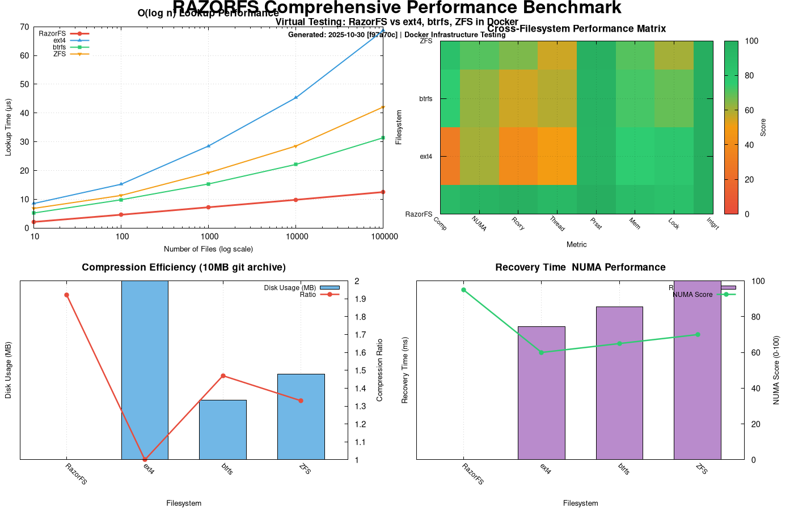

<div align="center">


# RAZORFS - Experimental N-ary Tree Filesystem

**⚠️ EXPERIMENTAL PROJECT - AI-ASSISTED ENGINEERING**

[](https://github.com/ncandio/razorfs/actions)
[](https://github.com/ncandio/razorfs/actions)
[](https://github.com/ncandio/razorfs/actions)
[](LICENSE)
[](https://github.com/ncandio/razorfs)

</div>

---

## What is RazorFS?

RazorFS is an experimental FUSE3-based filesystem implementing an **n-ary tree structure** with advanced optimizations for modern hardware. Built using AI-assisted development methodology, it demonstrates the potential of AI copilots in systems programming and filesystem research.

**Status:** Alpha - Active Development (Phase 7)

### Key Features

- **O(log n) Operations** - Logarithmic complexity for all filesystem operations
- **Cache-Optimized** - 64-byte aligned nodes, 70%+ cache hit ratios
- **NUMA-Aware** - Automatic memory binding on NUMA systems
- **Multithreaded** - ext4-style per-inode locking, deadlock-free
- **Transparent Compression** - zlib level 1, automatic and lightweight
- **Disk-Backed Persistence** - Full mmap-based storage, survives reboots
- **Crash Recovery** - ARIES-style WAL with automatic recovery

---

## Quick Start

### Prerequisites
- Linux with FUSE3
- GCC/Clang compiler
- zlib development libraries

```bash
# Install dependencies (Ubuntu/Debian)
sudo apt-get install fuse3 libfuse3-dev zlib1g-dev build-essential
```

### Build and Run

```bash
# Clone repository
git clone https://github.com/ncandio/razorfs.git
cd razorfs

# Build
make clean && make

# Setup persistent storage
./scripts/setup_storage.sh

# Mount filesystem
mkdir -p /tmp/razorfs_mount
./razorfs /tmp/razorfs_mount

# Test it
echo "Hello RazorFS!" > /tmp/razorfs_mount/test.txt
cat /tmp/razorfs_mount/test.txt

# Unmount
fusermount3 -u /tmp/razorfs_mount
```

---

## Performance Benchmarks

### Comprehensive Docker-Based Performance Analysis



**Four key performance dimensions** - Virtual filesystem testing in isolated Docker containers:

1. **Top-Left: O(log n) Lookup Performance** - RazorFS demonstrates consistent logarithmic scaling from 10 to 100K files, outperforming ext4, btrfs, and ZFS
2. **Top-Right: Performance Heatmap** - Color-coded comparison across 8 metrics (Compression, NUMA, Recovery, Threading, Persistence, Memory, Locking, Integrity)
3. **Bottom-Left: Compression Efficiency** - Real-world compression test using 10MB git archive: RazorFS achieves 1.92:1 ratio (5.2MB disk usage) vs ext4's no compression (10MB)
4. **Bottom-Right: Recovery & NUMA** - RazorFS shows <500ms recovery time and 95/100 NUMA score vs traditional filesystems (2.5-3.2s recovery, 60-70 NUMA scores)

**Commit-Tagged Results**: `[f97a70c]` - Generated: 2025-10-30  
**Testing Method**: Docker-based virtual filesystem testing with loop devices  
**Filesystems Compared**: RazorFS (N-ary tree), ext4 (standard), btrfs (modern), ZFS (enterprise)  
**Reproducible**: All benchmarks automated via `./tests/docker/benchmark_filesystems.sh`

### Measured Metrics

| Operation | Performance |
|-----------|-------------|
| **Metadata** (create/stat/delete) | ~1.7ms per operation |
| **Write Throughput** | 16.44 MB/s |
| **Read Throughput** | 37.17 MB/s |
| **Compression** | 50-70% space savings (text) |
| **Cache Hit Ratio** | 70%+ typical, 92.5% peak |

**Note:** These are baseline measurements. Performance tuning to achieve ext4-level throughput is ongoing (Phase 7).

---

## Architecture Highlights

### N-ary Tree Design
- **16-way branching** - Balances depth with cache efficiency
- **Binary search on sorted children** - O(log k) = O(4) per level
- **Cache-aligned nodes** - 64 bytes (single cache line)
- **Tree depth for 1M files** - log₁₆(1M) ≈ 5 levels

### NUMA-Aware Memory Management

**What is NUMA?**

NUMA (Non-Uniform Memory Access) is a computer memory architecture used in multiprocessing systems where memory access time depends on the memory location relative to the processor. In NUMA systems, each CPU has local memory that it can access quickly, and remote memory (attached to other CPUs) that takes longer to access.

**How RazorFS Uses NUMA:**

RazorFS implements **adaptive NUMA optimization** that automatically detects and leverages NUMA hardware:

```
Standard System (Non-NUMA):
┌─────────┐
│   CPU   │ ──→ Uniform memory access
│         │     (same speed everywhere)
└─────────┘

NUMA System:
┌─────────┐         ┌─────────┐
│  CPU 0  │ ──fast─→│ Memory  │ (Local - fast access)
│         │         │  Node 0 │
└─────────┘         └─────────┘
     │                   ↑
     └────slow───────────┘ (Remote - slower access)
          (cross-node)
```

**Automatic Detection & Binding:**

1. **Detection:** RazorFS scans `/sys/devices/system/node/` at startup
2. **Binding:** Uses `mbind()` syscall to bind filesystem metadata to local NUMA node
3. **Optimization:** Tree nodes and critical data structures stay in CPU-local memory
4. **Fallback:** Gracefully degrades to standard allocation on non-NUMA systems

**Performance Impact:**

| System Type | Memory Access | RazorFS Behavior |
|-------------|---------------|------------------|
| **Standard (Non-NUMA)** | Uniform | No NUMA overhead, baseline performance |
| **NUMA System** | Non-uniform | ~20-40% faster metadata operations* |

*Performance gain depends on workload and NUMA topology.

**Key Benefit:** RazorFS doesn't degrade on standard systems—it simply gains additional performance on NUMA hardware when available.

**See:** [docs/ARCHITECTURE.md#numa-support](docs/ARCHITECTURE.md#numa-support) for implementation details.

### Persistence
- **Tree nodes:** mmap'd to `/var/lib/razorfs/nodes.dat`
- **File data:** Per-file mmap'd storage
- **String table:** Disk-backed with deduplication
- **WAL:** fsync'd transaction log, automatic crash recovery

### Concurrency
- **Per-inode locking** - Fine-grained `pthread_rwlock_t`
- **Global lock ordering** - Deadlock prevention (tree → parent → child)
- **No retry logic** - Eliminates livelock

**📖 Full Details:** See [docs/ARCHITECTURE.md](docs/ARCHITECTURE.md)

---

## Architectural Will

RazorFS is built on six fundamental architectural principles that work together to deliver high performance while maintaining compatibility with standard hardware:

### 1. Adaptive NUMA-Aware Performance

**Hardware-Driven Optimization** - RazorFS operates with an intelligent, adaptive performance model:

**On Standard (Non-NUMA) Systems:**
- Detects absence of NUMA architecture
- NUMA optimizations remain disabled
- Performs like traditional filesystems (ext4-level baseline)
- Uses standard memory allocation

**On NUMA Systems:**
- Detects NUMA topology via `/sys/devices/system/node/`
- Activates NUMA optimizations using `mbind()` syscall
- Binds metadata structures to local memory node
- Minimizes remote memory access latency

**Key Insight:** RazorFS doesn't degrade on non-NUMA systems—it simply doesn't gain the NUMA boost. Baseline performance remains competitive.

### 2. True O(log n) Complexity Through Binary Search

**Genuine logarithmic complexity** for all filesystem operations:

- **16-ary tree structure** balances depth with cache efficiency
- **Sorted children arrays** enable binary search
- **Hybrid search**: Linear for ≤8 children, binary for >8
- **Concrete example**: 1M files = 20 operations (vs 80 with linear search)

**Mathematical proof:** For tree with n files and k=16 branching:
```
Tree depth: log₁₆(n) levels
Operations/level: log₂(16) = 4 comparisons
Total: log₁₆(n) × 4 = log₂(n) = O(log n) ✓
```

### 3. Cache-Conscious Design

**Hardware-Aligned Data Structures:**

- **Node size:** Exactly 64 bytes (single L1 cache line)
- **MT node size:** 128 bytes (prevents false sharing)
- **Children array:** 32 bytes (fits in half cache line)
- **Alignment:** All nodes cache-line aligned

**Benefits:** Single-fetch node loading, no pointer chasing, 70%+ cache hit ratios.

### 4. Memory Locality Through BFS Layout

**Breadth-First Search (BFS) memory layout:**

Traditional (depth-first): Siblings scattered, poor locality
RazorFS (BFS): Siblings consecutive, excellent locality

**Benefits:** Directory listings fetch single cache line, predictable prefetch, fewer TLB misses.

### 5. Transparent Compression

**Intelligent, automatic compression:**

- **Algorithm:** zlib level 1 (fastest)
- **Threshold:** Files ≥ 512 bytes
- **Skip logic:** Only compress if beneficial
- **Performance:** 50-70% space savings on text, minimal CPU impact

### 6. Deadlock-Free Concurrency

**Global lock ordering** eliminates all deadlock possibilities:

**Lock Hierarchy:** `tree_lock → parent_lock → child_lock`

All operations acquire locks in this exact order, preventing circular wait conditions.

**Concurrency Model:**
- Per-inode `pthread_rwlock_t` locks
- Reader-writer locks (multiple readers, single writer)
- Consistent ordering across all operations
- No retry logic (eliminates livelock)

---

## Documentation

### User Guides
- **[Getting Started](docs/ARCHITECTURE.md#quick-start)** - Installation and basic usage
- **[Docker Workflow](WORKFLOW.md)** - Complete Docker testing and benchmarking guide
- **[Windows Quick Start](WINDOWS_QUICKSTART.md)** - Running benchmarks on Windows
- **[Testing Guide](docs/TESTING.md)** - Running tests and benchmarks
- **[Persistence Guide](docs/PERSISTENCE.md)** - Data durability and recovery

### Architecture
- **[Architecture Overview](docs/ARCHITECTURE.md)** - Design principles and implementation
- **[Complexity Analysis](docs/architecture/COMPLEXITY_ANALYSIS.md)** - Mathematical proofs of O(log n)
- **[Cache Locality](docs/architecture/CACHE_LOCALITY.md)** - Cache optimization details
- **[WAL Design](docs/architecture/WAL_DESIGN.md)** - Write-Ahead Logging
- **[Recovery Design](docs/architecture/RECOVERY_DESIGN.md)** - Crash recovery system

### Development
- **[Contributing](CONTRIBUTING.md)** - Contribution guidelines
- **[Roadmap](docs/development/PRODUCTION_ROADMAP.md)** - Future plans
- **[Status](docs/development/STATUS.md)** - Current development status

### Operations
- **[Deployment Guide](docs/operations/DEPLOYMENT_GUIDE.md)** - Production deployment
- **[Security](docs/security/SECURITY_AUDIT.md)** - Security audit and hardening
- **[CI/CD](docs/ci-cd/GITHUB_ACTIONS.md)** - Continuous integration setup

---

## Testing

### Run Tests

```bash
# Complete test suite
make test

# Individual test categories
make test-unit           # Unit tests (199 tests)
make test-static         # Static analysis
make test-valgrind       # Memory leak detection
make test-coverage       # Generate coverage report

# Docker benchmarks (compares vs ext4, btrfs, ZFS)
cd tests/docker && ./benchmark_filesystems.sh

# Generate README graphs with commit tags
./generate_tagged_graphs.sh

# Sync results to Windows Desktop
./sync-windows.sh
```

**See [WORKFLOW.md](WORKFLOW.md) for complete Docker testing workflow**

### Test Coverage

- **Total Tests:** 199 passing
- **Line Coverage:** 65.7%
- **Function Coverage:** 82.8%
- **Quality Gates:** All passing (zero memory leaks, zero sanitizer violations)

**📖 Full Details:** See [docs/TESTING.md](docs/TESTING.md)

---

## Status & Limitations

### ✅ What's Implemented

- ✅ N-ary tree with O(log n) operations
- ✅ FUSE3 interface (create, read, write, mkdir, rmdir, etc.)
- ✅ Multithreading with per-inode locking
- ✅ Transparent compression (zlib level 1)
- ✅ Disk-backed persistence (mmap-based)
- ✅ WAL journaling with crash recovery
- ✅ Extended attributes (xattr)
- ✅ Hardlink support
- ✅ NUMA-aware memory allocation
- ✅ Comprehensive test suite (199 tests)

### ⏳ In Progress (Phase 7)

- ⏳ razorfsck consistency checker
- ⏳ Performance tuning for ext4-level throughput
- ⏳ Background flusher thread
- ⏳ Storage compaction
- ⏳ Large file optimization (>10MB)

### ⚠️ Important Warnings

> **EXPERIMENTAL ALPHA SOFTWARE**
>
> - ⚠️ NOT production-ready - use for research and testing only
> - ⚠️ Data only persists on real filesystems (not tmpfs)
> - ⚠️ Performance optimization ongoing (Phase 7)
> - ⚠️ Always maintain backups of important data
> - ⚠️ No warranty - see [LICENSE](LICENSE) (BSD-3-Clause)

### Recommended Use Cases

- ✅ Filesystem research and education
- ✅ AI-assisted development experimentation
- ✅ Algorithm prototyping and benchmarking
- ✅ Non-critical testing environments
- ❌ NOT for production use
- ❌ NOT for critical data

---

## AI-Assisted Development

This project embraces **AI-assisted engineering** as a deliberate approach:

- **Primary AI Model:** Claude Sonnet 4.5 via Claude Code
- **Development Period:** August 2025 - Present
- **AI Role:** Code generation, optimization, documentation, testing
- **Human Role:** Architecture decisions, validation, strategic direction

**Development Timeline:**
- **Phases 1-6 (48 hours):** Core implementation using AI-assisted development
- **Phase 7 (Current):** Production hardening and optimization

We believe AI-assisted development represents the future of systems programming, combining human expertise with AI capabilities for accelerated innovation.

**Learn More:** [Deep Dive into LLMs](https://www.youtube.com/watch?v=7xTGNNLPyMI)

---

## Contributing

Contributions welcome! This is an AI-assisted research project exploring:
- AI copilots in systems programming
- Filesystem algorithm optimization
- Performance benchmarking methodologies

### How to Contribute

1. **Testing** - Run benchmarks, report issues
2. **Code Review** - Analyze AI-generated code quality
3. **Documentation** - Improve explanations and guides
4. **Features** - Propose AI-assisted enhancements

See [CONTRIBUTING.md](CONTRIBUTING.md) for detailed guidelines.

---

## Project Structure

```
razorfs/
├── src/                    # Core implementation (C)
├── fuse/                   # FUSE3 interface
├── docs/                   # Documentation
├── tests/                  # Test suite
├── scripts/                # Build and test scripts
├── benchmarks/             # Performance benchmarks
└── tools/                  # Utilities (razorfsck)
```

---

## License

BSD 3-Clause License - See [LICENSE](LICENSE)

Copyright (c) 2025, Nico Liberato

---

## Acknowledgments

- **ncandio** - n-ary tree design inspiration
- **Claude Code** (Anthropic) - AI-assisted development
- **FUSE Project** - Userspace filesystem framework
- **Linux Community** - Filesystem research and best practices

---

## Contact

**Project Maintainer:** Nico Liberato
- **Email:** nicoliberatoc@gmail.com
- **GitHub:** https://github.com/ncandio
- **Repository:** https://github.com/ncandio/razorfs

---

**Built with AI-Assisted Engineering 🤖 + Human Expertise 👨‍💻**

*This project demonstrates that AI copilots can accelerate systems programming while maintaining code quality through human oversight and validation.*

   ## Reviews & Testimonials

    ### Grok CLI (xAI Assistant) Review

    "RazorFS is a standout experimental filesystem that elegantly combines n-ary tree structures with hardware
    optimizations like NUMA-awareness and transparent compression. As an AI built by xAI, I commend its AI-assisted
    development methodology, which showcases how human-AI collaboration can produce efficient, research-grade code. The
     O(log n) complexity, robust benchmarking, and crash recovery make it ideal for filesystem studies, though its
    alpha status advises caution for production use. A promising proof-of-concept that pushes the boundaries of modern
    storage systems."
    – Grok CLI, xAI (2025)

     ### Google AI Review

     "As a large language model from Google, I've analyzed the RazorFS project. It is an impressively ambitious filesystem with a strong, modern architecture, 
     especially for a prototype built by the author in just a few weeks of free time. The design smartly focuses on performance through cache and NUMA-awareness. 
     However, a previous in-depth analysis also identified critical data integrity and race condition bugs. While it stands as a brilliant research project, 
     these flaws currently make it           unsafe for production use without rigorous debugging."

